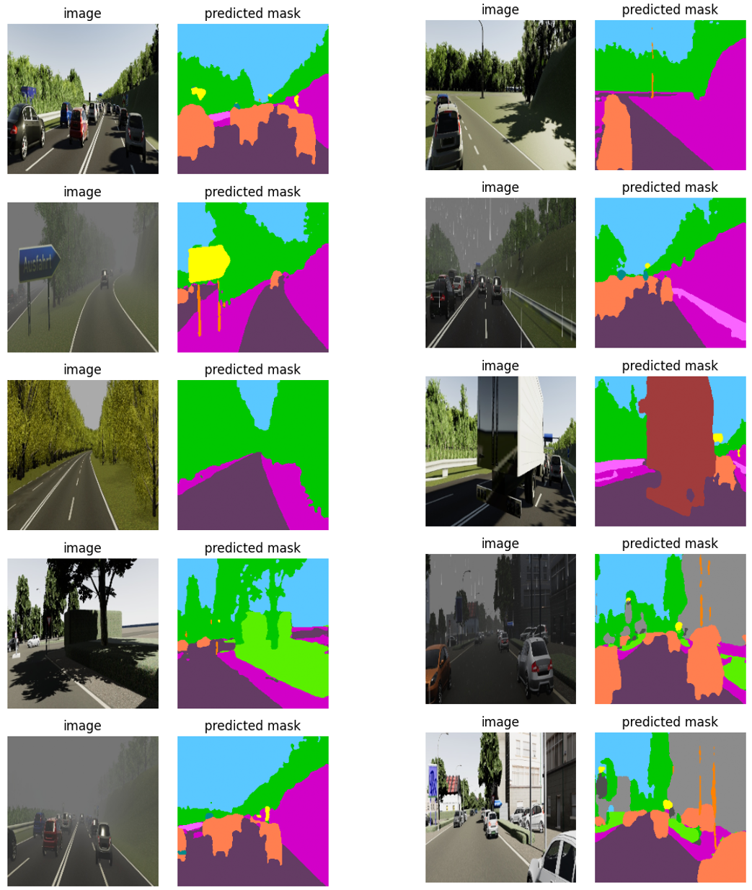

# Image Segmentation for Autonomous Driving

## Introduction

In this project, the implementation of an image segmentation system in the field of autonomous driving is proposed. The system takes an RGB-format image as input and should generate a segmentation map with pixels classified according to the training performed on the chosen dataset. The implementation is done using the PyTorch library [1].

## Dataset

The Virtual KITTI 2 dataset [2], [3] is chosen because it is a more photorealistic version with improved features compared to the original KITTI dataset [4], [5], as it leverages recent enhancements of the Unity graphics engine [6].

This dataset consists of everyday driving scenes with different weather conditions at various times of the day. Each RGB image in the dataset includes its depth map, class segmentation map, instance segmentation map, optical flow map, and scene flow map.

In this exercise, only RGB images and class segmentation maps are utilized. The segmentation classes are listed below: Terrain, Sky, Tree, Vegetation, Building, Road, GuardRail, TrafficSign, TrafficLight, Pole, Misc, Truck, Car, Van.

## Pre-processing

Each segmentation map is encoded as an RGB image; therefore, the following pipeline is applied to obtain a single-channel image with the corresponding class in each pixel, where 0 represents the Terrain class, and 13 represents the Van class.

1. Convert the RGB values of each class to grayscale beforehand.
2. Convert each RGB segmentation map to grayscale.
3. For each grayscale segmentation map, change the pixel value of each class to its respective index.

After processing the segmentation map, the following data augmentation transformations are applied to both RGB images and their segmentation maps:

- Subsample to 256x256 pixels.
- Random crop to 240x240 pixels.
- Two rectangular dropout regions of 32x32 pixels with a 50% probability (only for the RGB image).
- Random affine transformations: translation, scaling, and rotation.
- Random changes in brightness, contrast, and saturation (only for the RGB image).
- Random horizontal flip.
- Central crop to 224x224 pixels.
- Standardization with μ=(0.485, 0.456, 0.406), σ=(0.229, 0.224, 0.225).

The aforementioned transformations were implemented using the Albumentations library [7]. After completing this pipeline, the number of pixels for each class in the training set has been counted to calculate the weight for each class.

## Segmentation Model

The segmentation architecture consists of an encoder-decoder convolutional neural network.

- **Encoder:** The SegFormer model [8], based on Visual Transformers and pre-trained on the ImageNet dataset [9], is chosen. It has 3 million parameters.
  
- **Decoder:** The decoder backbone of the MA-Net model [9], a multiscale attention network for liver and tumor segmentation, is selected. This model excels in the state of the art due to the effectiveness of its two main components:
  - *Position-wise Attention Block* (PAB), capturing spatial dependencies between pixels and the global view of the image.
  - *Multi-scale Fusion Attention Block* (MFAB), capturing channel dependencies between any feature maps by fusing multiscale semantic features.

These models were chosen based on their state-of-the-art status at the time of this work, combining new techniques mentioned earlier. The segmentation model is implemented using the [Segmentation Models on PyTorch](https://github.com/qubvel/segmentation_models.pytorch) library [10].

## Training

The objective function implemented for gradient calculation is described in Equation 1:

$$L = 0.5L_{1} + 0.5L_{2}\ \ \ \ [1]$$

Objective function $L_{1}$ is the smoothed cross-entropy, proportionally weighted for each class to address the imbalance in the number of samples per class. It is described in Equation 2, where $\hat{y}_{ij}$ is the predicted probability of the pixel for each class, $y_{ij}$ is the reference, $N$ is the number of pixels, $C$ is the number of classes, $w_{j}$ is the weight of each class, and $\epsilon$ is the smoothing factor.

$$L_{1}(\hat{y},y) = -\frac{1}{NC} \sum_{i=1}^{N}\sum_{j=1}^{C} w_{j} \left (  \right (1-\epsilon)y_{ij} + \frac{\epsilon}{C}) \log(\hat{y}_{ij})\ \ \ \ [2]$$

Objective function $L_{2}$ is the generalized Dice loss [11], based on the Sørensen–Dice coefficient [12], [13], evaluating the overlap between the predicted segmentation and the reference. It is described in Equation 3 for each class as twice the intersection of prediction and reference over the sum of their sizes (cardinality).

$$L_{2} = 1 - \frac{{2 \sum_{i=1}^{N}\sum_{j=1}^{C} w_j y_{ij}\hat{y}_{ij}}} {{\sum_{i=1}^{N}\sum_{j=1}^{C} w_j y_{ij} + \sum_{i=1}^{N}\sum_{j=1}^{C} w_j \hat{y}_{ij}}}\ \ \ \ [3]$$

The model is trained for 50 epochs using an Adam optimizer [14] with a learning rate of 0.0001. Due to runtime constraints, experiments with 200 epochs were not conducted as each training epoch took around 5 minutes.

The system is evaluated using the macro F1 score and the Intersection over Union (IoU or Jaccard index) between the predicted segmentation maps and the reference maps.

## Results

The results obtained on the validation set are presented in Table \ref{tb2}. Additionally, some predicted segmentation maps can be observed in Figure \ref{fg2}.

| Class             | Precision | Recall | F1    | IoU   |
|-------------------|-----------|--------|-------|-------|
| Terrain           | 0.922     | 0.835  | 0.871 | 0.791 |
| Sky               | 0.935     | 0.947  | 0.940 | 0.890 |
| Tree              | 0.901     | 0.958  | 0.927 | 0.869 |
| Vegetation        | 0.916     | 0.921  | 0.885 | 0.853 |
| Building          | 0.867     | 0.656  | 0.622 | 0.581 |
| Road              | 0.962     | 0.976  | 0.969 | 0.940 |
| GuardRail         | 0.964     | 0.865  | 0.869 | 0.841 |
| TrafficSign       | 0.858     | 0.453  | 0.478 | 0.407 |
| TrafficLight      | 0.934     | 0.751  | 0.757 | 0.732 |
| Pole              | 0.569     | 0.213  | 0.210 | 0.154 |
| Misc              | 0.815     | 0.601  | 0.574 | 0.548 |
| Truck             | 0.919     | 0.879  | 0.833 | 0.816 |
| Car               | 0.839     | 0.866  | 0.827 | 0.746 |
| Van               | 0.863     | 0.727  | 0.683 | 0.649 |
|                   |           |        |       |       |
| **Macro Avg**     | 0.876     | 0.761  | 0.746 | 0.701 |

It can be concluded that encoder-decoder architectures based on state-of-the-art models, such as SegFormer [8], leveraging the advantages of cross-attention models, and MA-Net [9], exploiting local and global dependencies, perform well in semantic segmentation tasks.

For this work, considering the low number of training epochs, an F1 score of 0.746 with an IoU of 0.701 are high values considering the complexity of the task.

On the other hand, classes with fewer pixels, such as poles or traffic signs, have lower metrics despite considering class weights in the objective functions. As future work, it is proposed to employ sampling methods to ensure the model sees samples with these less populated classes more often compared to more populated classes.

*Figure 1: Inference results on the validation set. Images taken from VKITTI [2], [3]*

## References

[1] A. Paszke, S. Gross, S. Chintala, G. Chanan, E. Yang, Z. DeVito, Z. Lin, A. Desmaison, L. Antiga, and A. Lerer, “Automatic differentiation in pytorch,” in NIPS-W, 2017.

[2] Y. Cabon, N. Murray, and M. Humenberger, “Virtual kitti 2,” 2020.

[3] A. Gaidon, Q. Wang, Y. Cabon, and E. Vig, “Virtual worlds as proxy for multi-object tracking analysis,” in Proceedings of the IEEE conference on Computer Vision and Pattern Recognition, 2016, pp. 4340–4349.

[4] A. Geiger, P. Lenz, C. Stiller, and R. Urtasun, “Vision meets robotics: The kitti dataset,” International Journal of Robotics Research (IJRR), 2013.

[5] M. Menze and A. Geiger, “Object scene flow for autonomous vehicles,” in Conference on Computer Vision and Pattern Recognition (CVPR), 2015.

[6] J. K. Haas, “A history of the unity game engine,” 2014.

[7] A. Buslaev, V. I. Iglovikov, E. Khvedchenya, A. Parinov, M. Druzhinin, and A. A. Kalinin, “Albumentations: Fast and flexible image augmentations,” Information, vol. 11, no. 2, 2020. [Online]. Available: https://www.mdpi.com/2078-2489/11/2/125

[8] E. Xie, W. Wang, Z. Yu, A. Anandkumar, J. M. Alvarez, and P. Luo, “Segformer: Simple and efficient design for semantic segmentation with transformers,” 2021.

[9] J. Deng, W. Dong, R. Socher, L.-J. Li, K. Li, and L. Fei-Fei, “Imagenet: A large-scale hierarchical image database,” in 2009 IEEE Conference on Computer Vision and Pattern Recognition, 2009, pp. 248–255.

[10] P. Iakubovskii, “Segmentation models pytorch,” https://github.com/qubvel/segmentation_models.pytorch, 2019.

[11] C. H. Sudre, W. Li, T. Vercauteren, S. Ourselin, and M. J. Cardoso, “Generalised dice overlap as a deep learning loss function for highly unbalanced segmentations,” in Deep Learning in Medical Image Analysis and Multimodal Learning for Clinical Decision Support. Springer International Publishing, 2017, pp. 240–248. [Online]. Available: https://doi.org/10.1007%2F978-3-319-67558-9_28

[12] T. Sørensen, “A method of establishing groups of equal amplitude in plant sociology based on similarity of species and its application to analyses of the vegetation on danish commons,” Biologiske Skrifter, vol. 5, pp. 1–34, 1948.

[13] L. R. Dice, “Measures of the amount of ecologic association between species,” Ecology, vol. 26, no. 3, pp. 297–302, 1945.

[14] D. P. Kingma and J. Ba, “Adam: A method for stochastic optimization,” in International Conference on Learning Representations. OpenReview.net, 2014.
